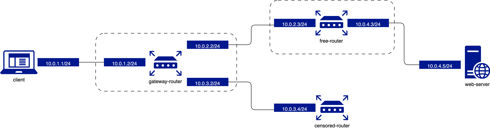

# eBPF-ReTRAC

## Introduction

eBPF-ReTRAC is a kernel-level, eBPF-based system for evading Internet censorship policies automatically enforced by network devices in state-controlled or otherwise censoring networks. Assuming that there exists at least one uncensored route between a client and destination, and that there exists a load-balancing router at a hop prior to the censoring middlebox, eBPF-ReTRAC can force virually all HTTP traffic to traverse uncensored routes. eBPF-ReTRAC operates in two phases: it first probes for which source ports will cause load-balancing of packets along uncensored paths (which we term "free ports"), and then rewrites the source ports of all subsequent HTTP packets to known free ports. It is deployed only at the client without requiring the cooperation of other network devices such as Internet routers or the destination server.

## Usage

The current implementation remains a proof-of-concept that is only tested in a virtualized setup that simulates a censoring network. Please note that setting up the virtualized environment can be machine-specific and may require some troubleshooting. We provide a high-level overview of the setup process below, but please refer to the [Vagrant documentation](https://www.vagrantup.com/docs) for more information.

### Prerequisites

- Ubuntu 22.04 LTS
- Clang 14.0.0-1ubuntu1.1
- Vagrant 2.2.19
- KVM/QEMU 6.2.0

### Virtual Network Setup

- We use Vagrant to manage five virtual machine instances: client, gateway (router), free (router), censored (router), and webserver.

- The network topology is illustrated:

#### Setup virtual machines
- In the eBPF-ReTRAC directory, run `vagrant up` to spin up all five virtual machines.
- Run `vagrant ssh <vm_name>` to ssh into a virtual machine.

#### To change routing rules on the gateway router:
  1. `vagrant ssh gateway`
  2. `cd /vagrant`
  3. Modify NUM_FREE_PORTS in gen_rand_port.py
  4. `./gen_rand_port.sh`
  5. `sudo ./del_all_ip_rules.sh`
  6. `sudo ./add_ip_rule.sh`

#### To load eBPF-ReTRAC on the client:
  1. `vagrant ssh client`
  2. `cd /vagrant`
  3. `./setup_ebpf_retrac.sh <interface> [--teardown]`
    - An network interface must be specified to load eBPF-ReTRAC on. The teardown option removes the eBPF program from the interface and cleans cached free ports.
    - Example: `./setup_ebpf_retrac.sh eth1 --teardown`, then `./setup_ebpf_retrac.sh eth1`
